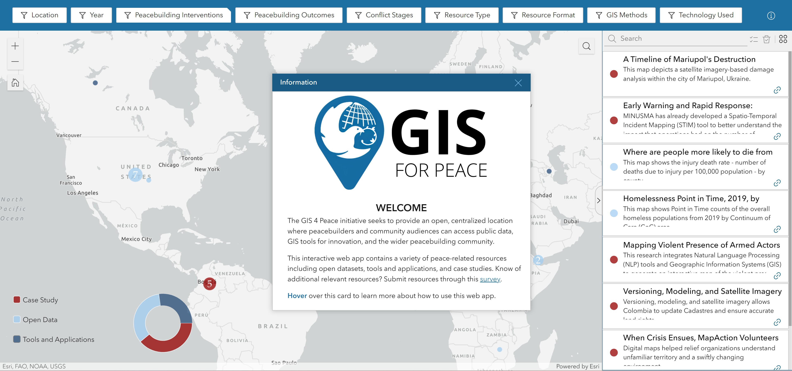

#### Report
This summer I worked for the non-profit organization Data Science for Social Development ([DSSD]([https://zgis.maps.arcgis.com/apps/instant/insets/index.html?appid=b1a635e1425c4dd39385bc8fd9c8256e](https://dssdglobal.org/)https://dssdglobal.org/)). Initially, I was tasked with working with an external partner to develop a storymap and dashboard related to their projects and organization. However, after our initial consultation, the partner decided to push their work with DSSD to next year. This meant that I had to pivot to working on an internal project at DSSD. I was assigned to the GIS for Peace project and given full control over completely overhauling the project to make it more streamlined and interactive. 

The GIS for Peace project was developed by DSSD in partnership with ESRI and the Alliance for Peacebuilding to facilitate an increased uptake of GIS throughout the peacebuilding community through the creation of a database for GIS peace-related resources. The project is focused on collecting resources that fall into three categories: open data, tools and applications, and case studies. When I joined the project, the resources were split into three interactive, searchable, and filterable databases. Each database had an associated survey for data collection and the data was presented to users in a list format on the hub site associated with the project. In essence, DSSD had created three different surveys, web maps, and web apps for each resource type and hosted each of them on their hub site.
My task was to create an easy-to-maintain community engagement platform which conveys how GIS can enhance peacebuilding initiative where users can access public data, tools for innovation, and the wider peacebuilding community. As such, I had to ensure that there was only one survey, web map, and web app for all of the combined resources. Additionally, I was asked to create a map-centric interface for the database as opposed to the former list format. 

My first, and most important, step was combining the three different surveys for each resource type into one single survey using Survey123. This turned about to be trickier than I had anticipated. While most of the survey questions for each of the resource types were identical, figuring out how to incorporate the type-specific questions into one survey in a way that was comprehensible and appealing to users was hard. On top of that, issues with logic, grouping, and the constrain of only having one location (map or address) element in the survey proved difficult but not impossible. After a few weeks of repeatedly redesigning and user-testing the survey, I was able to move onto the next step of data entry. The project had already collected more than 100 resources prior to my redesign, but because there is no simple way to transfer records from one survey to another in Survey123, I had to spend a lot of time entering old resourced into the new survey. Given the importance of the survey and the number of records that needed to be transferred, I spent more time than I anticipated on just developing the backend data collection for this project. 

Once I was done with the survey, I was able to move onto designing a map-centric, interactive user interface to display the collected resources. This consisted of developing a web map as well as a web app. After a great deal of discussion with my supervisors and other members of the DSSD team, I settled on a cluster-based design for the web map. Next, I focused on developing a web app to display this web map in. I developed a dashboard initially, but quickly realized that a dashboard did not allow for all of the features desired for the web app, so I pivoted to using experience builder. 

This project was the first time I had ever used experience builder. There was a bit of a learning curve for experience builder, but once I got more familiar with the software, I began to see all the advantages and opportunities it provided. Like the other components of this project, there was a lot of discussion related to the features and functionality of the web app which meant that I was constantly redesigning and making tweaks to the app until it was satisfactory. After completing the web app, I was able to demonstrate my work (survey redesign and web app creation) to our ESRI partners. I got a lot of really great feedback from them and, overall, they were impressed with the work I had done. During the meeting, we also spent a lot of time discussing the future of this project. Our ESRI partners were really helpful in suggesting next steps and new potential partners for the project. It was great to see that my work would be useful for future projects and that it might even be scaled up in the future. 

As a final step for the project and my last task for my internship, I was also asked to propose a new layout for the hub featuring the new products I had created, which I did using Figma. At the moment my changes have not been made live as the future of the project is still being discussed but below is a sneak peak of my final web app. 

See the hub here: ([GIS for Peace](https://gis-4-peace-dssdglobal.hub.arcgis.com/)) 

Overall, I had a great experience at my internship. I really enjoyed the fact that I was given a lot of freedom in the redesign of the project as I was given total responsibility for it. The project that I worked on certainly was a lesson in patience. There were many times that I had to re-evaluate and redo portions of the entire project due to team member and user feedback. However, in the end, this only served to make my final products all the better. Additionally, I found that my tasks during the internship allowed for a good mix of old and new skills. I was able to rely on my previous knowledge and skills to develop the survey and web map but I also learned a whole new software with experience builder. At the same time, I was able to connect with a whole new community through the DSSD team and our ESRI and Alliance for peacebuilding partners. So even though I was working alone on this project, I really felt supported by my team. I met with my supervisor every two weeks and was able to contact the DSSD team at any time via slack. On top of that I was able to meet with the greater DSSD a couple of times during my internship and each time we met the team provided invaluable feedback and support. I would strongly encourage students and recent graduates to consider an internship not just as a way to gain new skills but also as a way to find and build strong and supportive personal and professional networks. 

