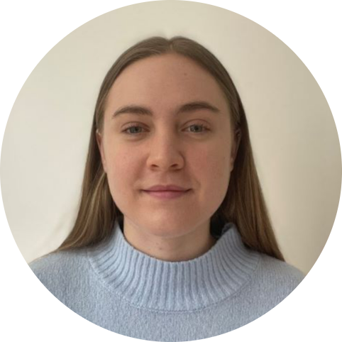

Welcome, 

I couldn’t be more excited to share my GIS work with you all through this site. I am a map-lover with a Bachelor's degree in geography and a minor in data science. After graduating, I worked in a year-long fellowship position as a GIS technician where I assisted students with troubleshooting geospatial projects, offered guidance and technical assistance to students, faculty, and community members on geospatial technology applications, and taught geospatial software demonstrations. I am currently completing the Copernicus in Digital Earth joint Master Degree program where I spent one year studying geoinformatics in Salzburg, Austria and am finishing up my final year studying cartography in Olomouc, Czechia. The focus of my thesis is on creating a tactile atlas of the sixth Sustainable Development Goal (Clean Water and Sanitation) for students who are blind or visually impaired (you can see some a draft of some of my early work here: [Portfolio](MadelineMulder_Portfolio.pdf) ). 

Check out a selection of my best cartographic work from my year in Olomouc in my portfolio here: [Sustainable Development Goal 6 Tactile Maps Sample](MadelineMulder_ThesisSample.pdf) 

